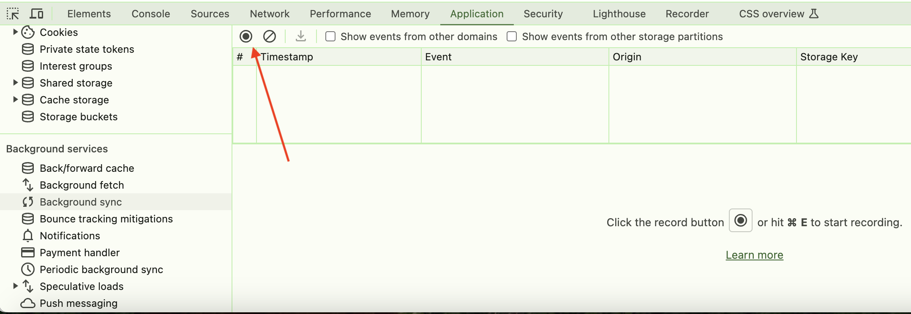
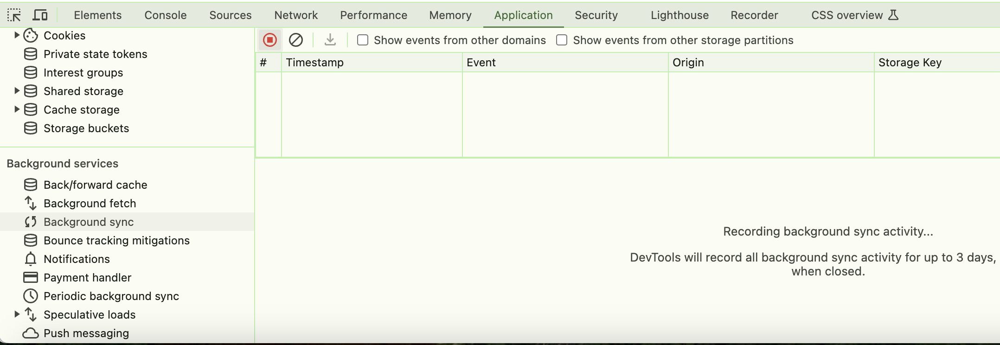
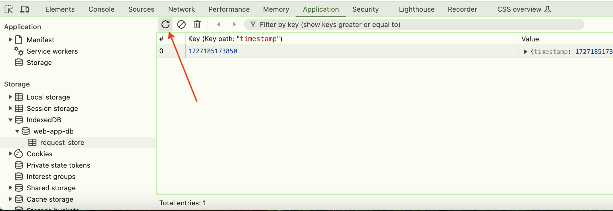
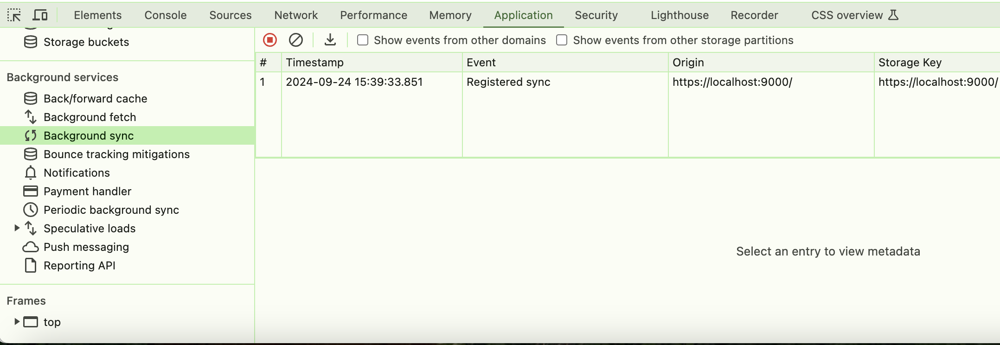
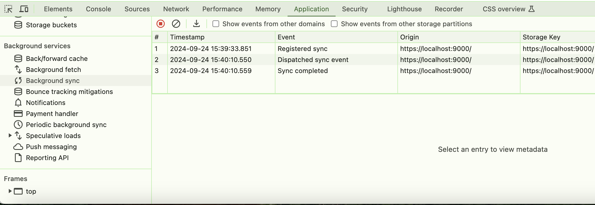

# Basic Service Worker

This is a basic Service Worker that you can use to make your web app work offline. It does so by caching all static 
assets and responses for routes in your web app, and storing POST, PUT and DELETE requests in IndexedDB that are made 
when the app is offline which can be retried when the app is back online.

## How it works

A Service Worker is a special kind of Web Worker that can intercept and respond to network requests. When a request is 
made while the web app is offline, the Service Worker can intercept it and serve a response from its cache. This cache 
typically contains static assets like images, stylesheets, JavaScript etc. but it can also contain full HTML pages. The 
Service Worker matches any request against its cache and can then serve the response from there.

It can also cache responses to API calls or save outgoing requests while the web app is offline and then send them when 
the app is back online.

This basic version takes care of caching all assets locally, providing responses for the routes you provide and storing 
POST requests while the app is offline which are retried when the app is back online.

### Usage

Place `service-worker.js` and `sw-registration.js` in the root folder of your web app and include `sw-registration.js` 
in the footer of each page:

```javascript
<script src="/sw-registration.js"></script>
```

This script will take care of registering the Service Worker and updating it if there's a new version. When this new 
version is detected, it will be installed in the background and activated when the app is closed and reopened or when 
the user navigates to some other page in the app.

This ensures that the Service Worker will be updated and activated as soon as possible, although there may always be 
situations in which this will not immediately be on the very next navigation. After all, we're dealing with a network 
that can be unpredictable.

When the app is closed and a new Service Worker is installed when it's reopened, the next navigation will practically 
always result in a correct activation of the Service Worker.

### Note on iOS
The updating mechanism of this Service Worker makes use of the `pagehide` event. On iOS, this event is only reliably 
fired if the app is added to the Home Screen when the user closes the app from the app switcher. To add it to the Home 
Screen, open the app in Safari on iOS, go to the Share menu, scroll down and tap "Add to Home Screen".

### Caching assets and routes
Add the static files you want to cache to `staticFiles` and add the routes to `routes`in `service-worker.js`:

```javascript
// static files
const staticFiles = [
  '/index.html',
  '/src/css/styles.js',
  '/src/js/index.js',
  '/src/img/image.jpg',
  ...
];

// routes
const routes = [
  '/',
  '/about'
];
```
Adding routes ensures that your app can serve a response when offline for URLs that don't point to a file. In the above 
example, the Service Worker adds the HTML responses for `/` and `/about` to the cache.

**Make sure that your Service Worker does not throw any error when it's loaded, otherwise it will not work!**

### Storing requests while offline
The Service Worker stores all POST, PUT, DELETE and other explicitly listed requests that are made while the app is 
offline and retries these when the app is back online. You can adapt this to your own needs in the `isRequestEligibleForRetry` function. 

In supporting browsers, it uses the Background Sync API and in other browsers it posts a message to the Service Worker 
when the app comes back online. The latter offers less granular control than the Background Sync API but suffices for 
this demo.

### Updating the Service Worker
A Service Worker is considered updated if it's byte-different from the previous version. This means that any change will 
do, but it's good practice to add a version number to your Service Worker and increment this number any time you make a 
change. This number should also be added to the name of the cache that's used by the Service Worker so each Service 
Worker has its own cache:

```javascript
// Service Worker version number
const SW_VERSION = 123;

// name of the cache for the Service Worker with this version number
const cacheName = `web-app-cache-${SW_VERSION}`;
```

## Running the demo
This demo requires HTTPS so you will need a SSL certificate.

Make sure you have `openssl` installed.

To generate a self-signed certificate, run the following command:

```
npm run generate-cert
```
This will generate a self-signed certificate and place all the 
needed files in the `ssl` folder.

After that you will need to make your device trust the certificate.

On MacOS you do this by opening the Keychain Access app and then 
click `System` under `System Keychains` in the menu on the left.

Click the `Certificates` tab in the top menu and then drag the 
file `localhost-cert.pem` in the `ssl` folder onto the Keychain 
Access app.

Then double-click the certificate you just added, find the `Trust` 
section and click the arrow to open it.

In the select box labeled "When using this certificate", select 
"Always trust".

For Windows, refer to [this link](https://aboutssl.org/installing-self-signed-ca-certificate-in-window/).

Run `npm install` to install the local web server, then `npm start` and then the demo will be served at 
https://localhost:9000/

### Testing retry requests
In supporting browsers like Chrome and Edge, the Service Worker will use the Background Sync API to retry any stored 
requests. This works by registering a sync event for the stored requests that will be fired when the app comes back 
online.

You can monitor these sync events in the Application tab of Chrome devtools. Scroll down to Background Services and 
then click Background Sync. Then click the record button to start recording activity:



Recording sync events is now active:



Then disconnect your device from the network. *Note that the POST request is made to localhost as well so checking the 
"offline" checkbox for the Service Worker in the Application panel of devtools is not sufficient.*

Click the "Send POST request" button while offline. If you now check the "request-store" store in the Application tab 
under Storage > IndexedDB, you will see the stored request (you may need to click the refresh icon):



If you check Background Sync in the Application tab under Background Services, you will now see the registered sync 
event:



Now go back online and after the network is back, check Background Sync in the Application tab under Background 
Services again. You should now see that the sync event was dispatched and completed:



## Motivation

Web apps should be able to provide an as good as possible user experience, even when offline. They should **never** 
show a *"You are not connected to the internet"* screen. 

Ever.

It's bad user experience.

A web app should give the user at least *something* when offline. When a native (iOS or Android) app is offline it will 
never show only a screen that says you're not connected to the internet. It might notify you that you're offline, but it 
will at least give you something. Social media apps will show your timeline with the posts it had when the app went 
offline. The content may be outdated, but it's better than an empty screen saying you're offline.

But web apps do. And there's really no need for that because web apps are perfectly capable of working offline.

But most don't and that's incredibly harmful.

Very often, web apps only exist to get you to install the native app version. As soon as you visit the web app, you see
a banner that urges you to install the native app. The native app usually gives you more features and a better user 
experience. So the native app is *better*.

Often, the web app could offer those same features and the same user experience, but it doesn't. Its developers couldn't 
be bothered to implement them in the web app, or they simply don't even know that's possible. They may have seen other 
web apps that also weren't as good as their native counterparts and decided that web apps just "aren't as good as native
apps".

So now we're stuck with a whole generation of substandard web apps that only serve as decoys to get you to install 
their native versions. Considering this, I can't even blame people for thinking that native apps are better than web 
apps. Web apps can be just as good as native apps, but we'll have to *show* that.

How? 

By building absolutely great freaking web apps.

At the very least, your web app should be able to work offline and this basic Service Worker will help you do that.

*"But offline support doesn't make sense for my web app"*

Here's the thing:

**offline support makes sense for ALL web apps**

even if it's a social media or messaging app.

Here's why: "offline support" doesn't mean that you need to provide the exact same user experience as when the app is 
online. "Offline" doesn't necessarily mean that the app is completely offline. A far more common situation is that the 
user is on a flaky and/or slow connection that causes your web app to break. 

Even when you're on 5G, you can experience a bad or slow connection in certain areas or circumstances.

It is for those situations that your app should provide the best possible user-experience.

If your web app uses a Service Worker, it can cache all scripts, images, CSS and other assets locally, so when the user 
is on a bad connection, there is no bandwidth wasted on downloading these assets because they're already there. That 
limited bandwidth can then be used for other stuff so your web app still provides a good user-experience, despite the 
bad network.

THAT is what offline support means.

### Why web apps?

Web apps can be freely distributed on the internet, independent of any app store like Apple's App Store or Google's 
Play Store. This means you won't have to pay them 30% of your revenue and they can't kill your business by kicking you 
out of their store whenever they feel like it. You can just put your web app on the internet and people can install it 
from there. If you want to share your web app with people, just send them the link.

There's no need for separate codebases for iOS and Android, you only need HTML, CSS and JavaScript to run 
your app on any platform, both mobile and desktop.

Whenever there's an update of your web app, users don't need to go to an app store to download and install the new 
version as web apps update automatically. You just deploy a new version to the web server and the next time users open 
the app they will get the new version.

Since web apps consist of only HTML, CSS and JavaScript and run inside the browser's sandboxed environment, they are 
lightweight and secure.
